# Detecting the use of sunglasses in images using Amazon Rekognition Image

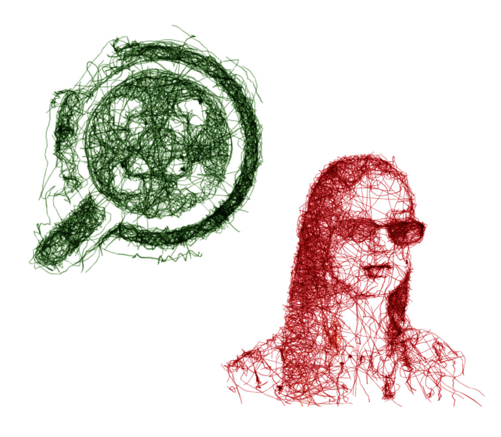

### AWS Implementation - Nahuel Montes de Oca

Supervised by
SA Roberto Landa

December 21, 2022

## Contents

- [1. Presentation](#1-presentation)
- [2. Theoretical framework](#2-theoretical-framework)
  - [2.1 Amazon Web Services](#21-amazon-web-services)
  - [2.2 Cloud computing with AWS](#22-cloud-computing-with-aws)
  - [2.3 Services used](#23-services-used)
- [3. Project](#3-project)
  - [3.1 How it started](#31-how-it-started)
  - [3.2 Operation](#32-operation)
  - [3.3 About the code](#33-about-the-code)
  - [3.4 Tests](#34-tests)
- [4. Conclusions](#4-conclusions)
- [5. Sources](#5-sources)

## 1. Presentation

My name is Nahuel Montes de Oca, I am currently studying for the AWS Solutions Architect
certification (SAA-C03), since last year I took the AWS re/Start program which allowed me
to be certified as a Cloud Practitioner and even more important, it opened the doors to cloud
computing, which I found very interesting since I was already internalized in the development
area for having started in Software Engineering and previous courses (mostly programming
and web development).
As for this personal project, it is intended not only as an implementation that could be
applied in many use cases, but also to start combining AWS services and understand how
cloud architectures can be created. In this case I used four services especially, but it can be
expanded to more if the situation requires it. Below is a detailed explanation of the services
involved and how they will communicate with each other.

### Contact:

Below is a list of links where you can find me, either to learn more about the project or any
other related question, suggestions or doubts are also welcome:

- [LinkedIn](https://www.linkedin.com/in/nahuelmontesdeoca/)
- [GitHub](https://github.com/devBochi)
- [email](mailto:mdosuareznahuel@gmail.com)

## 2 Theoretical framework

### 2.1 Amazon Web Services

Amazon Web Services (AWS) is the world’s most widely adopted and comprehensive cloud
platform, offering more than 200 end-to-end data center services globally. Millions of
customers, including the fastest growing startups, largest companies and leading government
agencies, are using AWS to reduce costs, increase agility and innovate faster.

### 2.2 Cloud computing with AWS

#### What is cloud computing?

Cloud computing is the on-demand delivery of IT resources over the Internet on a
pay-as-you-go basis. Instead of buying, owning and maintaining physical servers and data
centers, you can access technology services, such as computing capacity, storage and
databases, on an as-needed basis through a cloud provider such as Amazon Web Services
(AWS).

### 2.3 Services used

### Amazon Simple Storage Service (S3)

Amazon S3 is an object storage service built to store and retrieve any volume of data from
any location. It is a simple storage service that offers excellent durability, availability,
performance, security and virtually unlimited scalability at very low costs. Learn more [here](https://aws.amazon.com/s3/?nc2=type_a)

### Amazon Rekognition Image

Rekognition Image is an image recognition service with deep learning technology that detects
objects, scenes and faces; extracts text, recognizes famous people and identifies inappropriate
content in images. It also allows you to search and compare faces. Rekognition Image is based
on the same proven, highly scalable deep learning technology developed by Amazon’s

computer vision scientists to analyze billions of images a day for Prime Photos. The service
returns a reliability score for all the items it identifies so you can make well-informed decisions
about how to use the results. In addition, all detected faces are returned with coordinates of a
bounding box, a rectangular frame that encompasses the entire face and can be used to locate
the position of the face in the image. Learn more [here](https://aws.amazon.com/rekognition/image-features/?nc=sn&loc=3&dn=3)

### Amazon Lambda

AWS Lambda is a serverless computing service that executes code in response to events and
automatically manages the underlying computing resources. These events can be state
changes or an update, such as a user placing an item in a shopping cart on an e-commerce
website. You can use AWS Lambda to extend other AWS services with custom logic or build
your own backend services that operate at AWS scale, performance, and security. Learn more [here](https://aws.amazon.com/lambda/?nc1=h_ls)

### Amazon Simple Notification Service (SNS)

Amazon Simple Notification Service (Amazon SNS) is a web service that makes it easy to set
up, use and send notifications from the cloud. It offers developers highly scalable, flexible and
cost-effective functionality to publish messages from an application and deliver them
immediately to subscribers or other applications. It is designed to simplify developers’ use of
web-scale computing resources. Amazon SNS follows the ”publish-subscribe” (pub-sub)
messaging paradigm, with notifications sent to clients with a push mechanism that eliminates
the need to regularly check or ”poll” for new information or updates. Learn more here

> **_Note:_** The information detailed above has been extracted in its entirety from the website of [AWS](https://aws.amazon.com/)

## 3 Project

### 3.1 How it started

During the AWS re/Start course, I got to know the basic services, such as S3, Lambda and
SNS, among others. I also saw how they can be combined to perform automatic tasks or solve
everyday problems. In addition to this, a very interesting service appeared, Amazon
Rekognition, which as explained above, uses artificial intelligence for the recognition and
analysis of images or videos. It caught my attention because it has a large number of use
cases, which could be useful for a personal project.

I would like to make a special mention to my professor Roberto Landa, who previously shared
with me a similar implementation with the use of Amazon Rekognition (in this project the
use of a security helmet was detected, more info [here](https://docs.aws.amazon.com/rekognition/latest/dg/ppe-detection.html)), which was one of the cases that
encouraged me to apply it on my own, looking for information in the AWS documentation
and community resources on YouTube and StackOverflow.

### Use cases:

With the use of Amazon Rekognition, especially with this implementation, it can be applied
in several scenarios, where we can mention:

- Dress control in a store
- Interactive website
- Clothing or accessories store
- Search in a large number of files
- Image filtering

### Service communication:

Here you can see an image that shows, as a scheme, how the architecture works and which is
the operation that will be detailed later, where you can see two S3 buckets, one where the
image to be tested is placed, which activates the first Lambda function, which uses the
Amazon Rekognition AI. If it finds sunglasses on the person, the function copies the image to
the other bucket, thus activating the other Lambda, which sends an email notification to the
user.

Figure 1: Project architecture

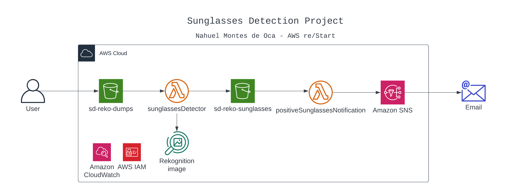

### 3.2 Operation

### How the procedure works

1. The image is uploaded (preferably with .png extension) to the ̈sd-reko-dumps ̈bucket.
2. The put event in the S3 bucket triggers the Lambda functionsunglassesDetector, which
   will analyze the file (image) involved in this event.
3. The function, using Amazon Rekognition Image, analyzes the image and determines if
   the person is wearing sunglasses.
4. If the answer to sunglasses is positive, it proceeds to copy the file to the other bucket
   called ”sd-reko-sunglasses”.
5. That copy generates the put event in that bucket.
6. The other Lambda functionpositiveSunglassesNotificationis triggered and sends the mail,
   using SNS, to the registered user
7. You can check the confirmation email and the copy of the file in the Management Console

### 3.3 About the code

In this article we have an example of a call to Lambda through the trigger s3-put, where we
can with the upload of the file to the bucket, activate the function to do inside the code what
we find necessary for the use of Rekognition:

(a) Lambda Function

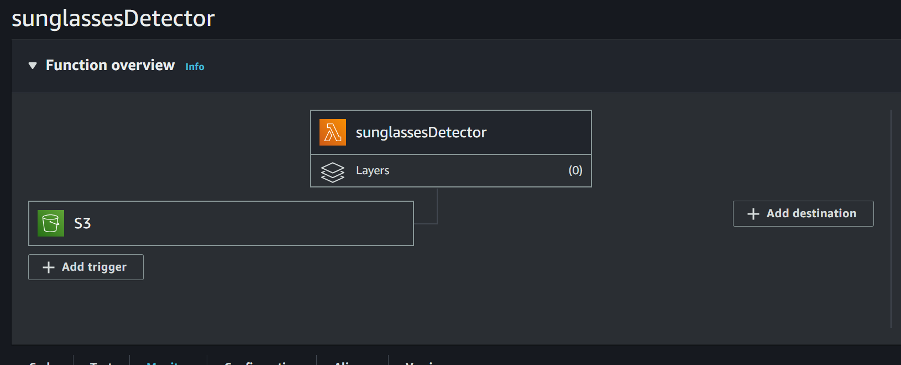

(b) S3 trigger

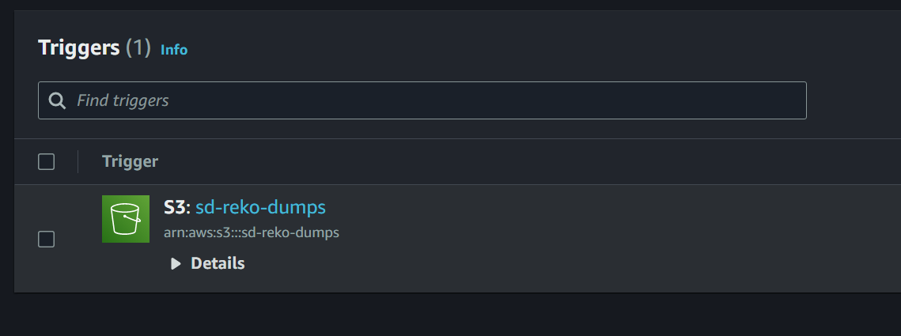

In this link we can see a little of how Rekognition can be used, through the SDK, in this case
we will use the programming languagepythonto work inside the Lambda function.
Herewe have an example of how is the response of the functiondetect-faces, which we will
use to determine if in our image there is a face, and consequently if the detected individual
has sunglasses, if so we proceed to the part of the copying to another S3 Bucket.
According to the CLI Command Reference documentation:

_"detect-faces detects the 100 largest faces in the image. For each face detected, the operation
returns face details. These details include a bounding box of the face, a confidence value (that
the bounding box contains a face), and a fixed set of attributes such as facial landmarks (for
example, coordinates of eye and mouth), presence of beard,sunglasses, and so on."_

After having solved the use of Rekognition, if positive, we can copy this image to the other
Bucket, as we can see in this article. Finally, the lambda function finishes its execution.
After having copied our image with positive response, this new S3-put event will activate the
other Lambda function that works very similar to the first one in the trigger part, but instead
of using the Rekognition functions, it will work with SNS to send an email to the registered user with a message as a notificationfor the positive response of the image in this case, with
the name of the uploaded file.

(a) Lambda Function

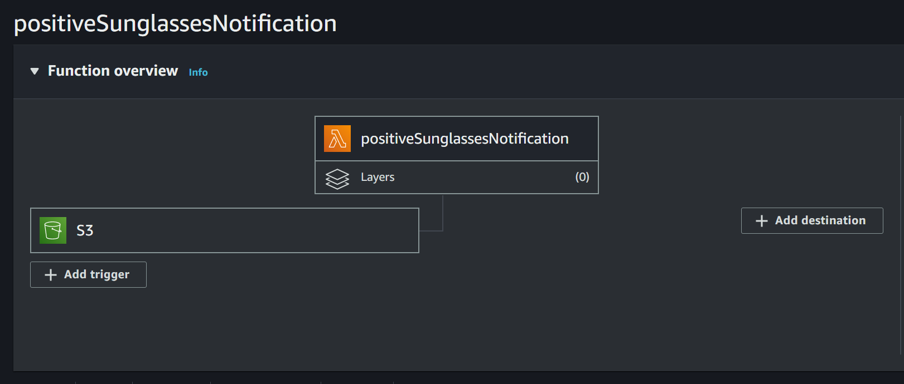

(b) S3 trigger

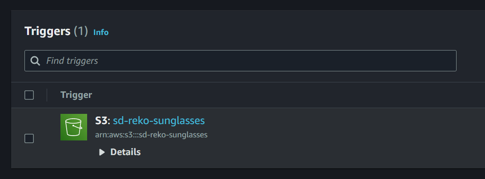

### 3.4 Tests

We start by choosing a couple of test subjects, in this case I used two people with one photo
positive and one photo negative to sunglasses, to see if the function serves its purpose:

I proceed to upload the images to the test bucket called ”sd-reko-dumps”, and we wait for the
first Lambda function to activate, we can verify it in the CloudWatch or Lambda console,
then we will see if the images were copied to the other bucket ”sd-reko-sunglasses” if the
person has sunglasses:

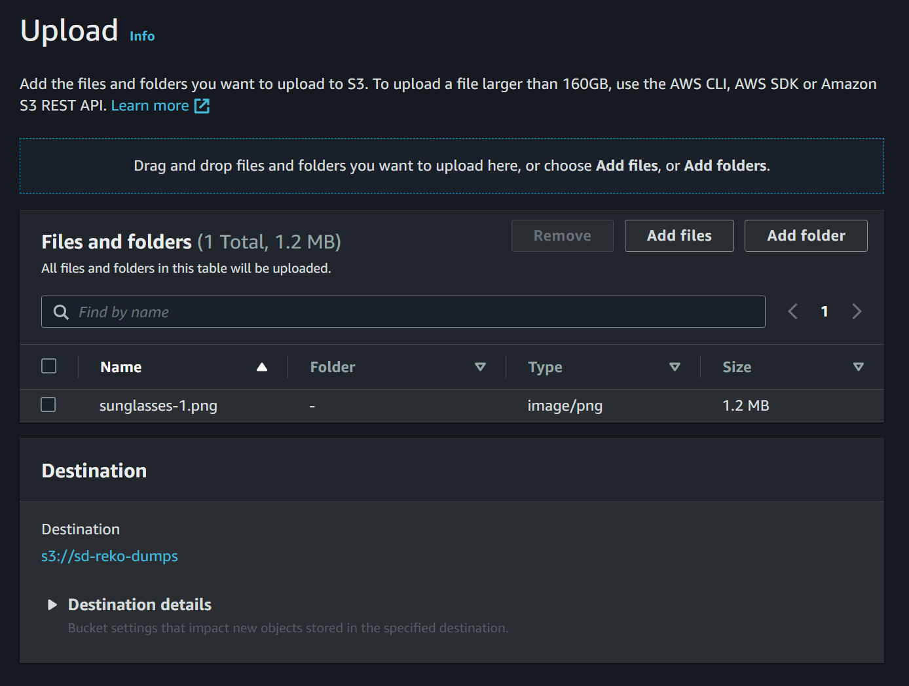

After completing the upload, we can see in the monitoring console the call to our Lambda
function and its response:

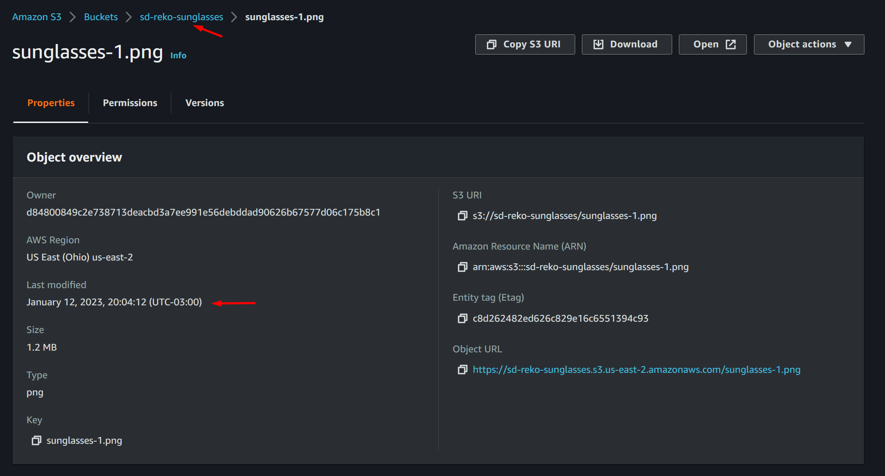

As the logs show, our first image contains a person wearing sunglasses, so it was copied into
the ”sd-reko-sunglasses” bucket instantly:

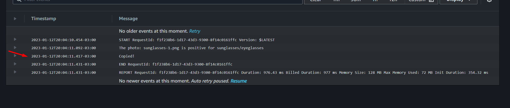

We continue with the upload of the next image, which does not have sunglasses:

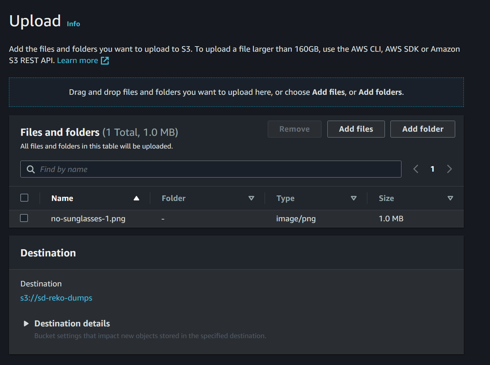

After completing the upload, we can see in the monitoring console the call to our Lambda
function and its response:

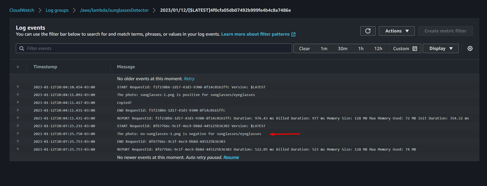

As the logs show, our second image does not contain a person wearing sunglasses, so it was
not copied to the other bucket.
I proceed to upload the remaining 2 images where we will see a summary of the calls to the
sunglassesDetectorfunction in the CloudWatch console through the logs below.

According to the answers shown above, we can see that only the images where the person is
wearing sunglasses were copied, which shows the correct functioning of the code in the two
Lambda functions, since you can also see the confirmation email:

(a) sd-reko-dumps bucket
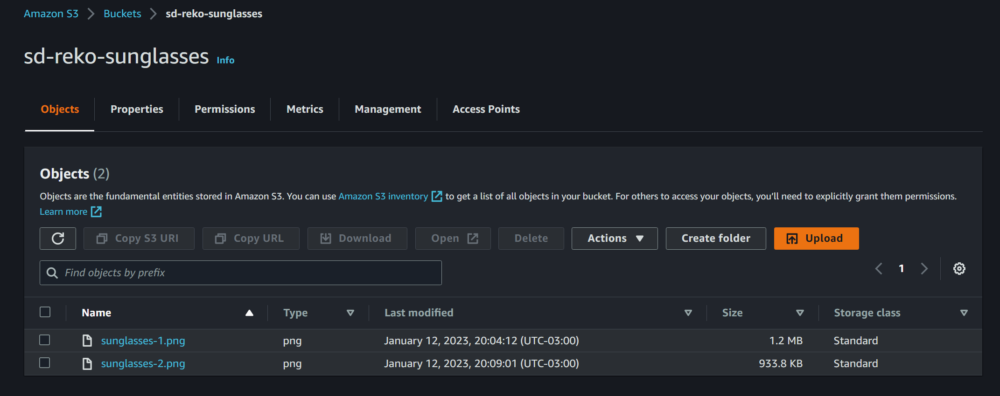

(b) sd-reko-sunglasses bucket

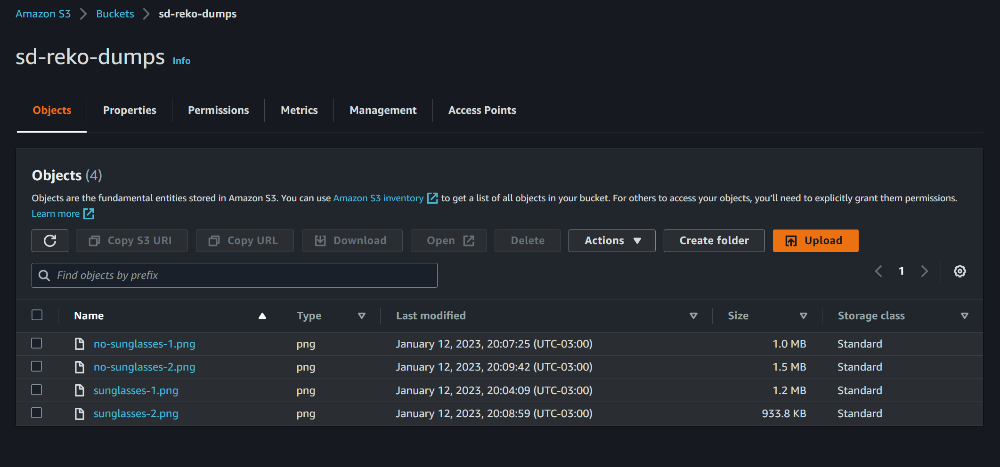

Below we can see the function calls in the CloudWatchconsole, where the execution times
and when they were triggered are detailed:

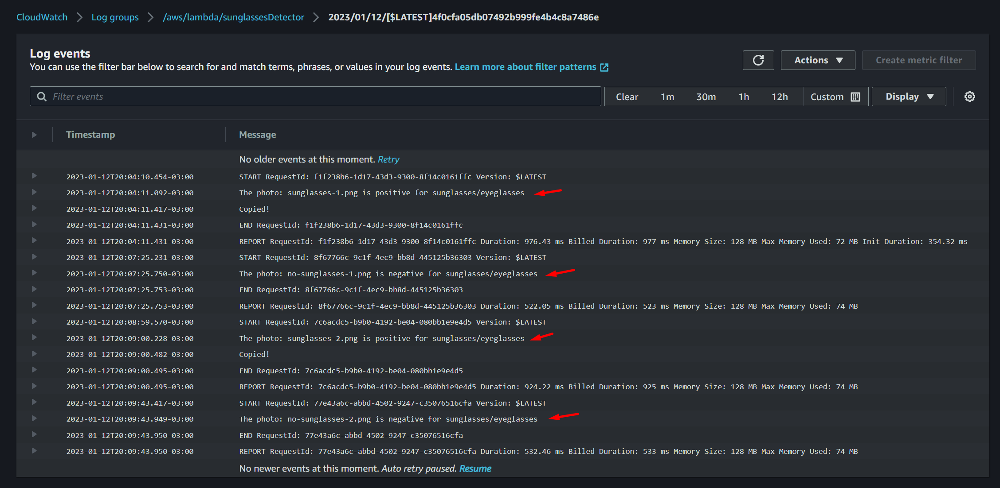

## 4 Conclusions

As we could see in the tests, the implementation works correctly, it fulfills its purpose of
organizing the files according to whether they match our condition or not. As I mentioned
before, this project is a basic architecture, which can scale in complexity if we have a more
specific scope or we can also combine it with other architectures that have larger purposes.
In this repositoryare the codes of the Lambda functions and the test subjects. For any doubt
or suggestion you can contact me through the links in the contact (1) section.

## 5 Sources

### Test subjects:

- 4a : Dua Lipa wearing sunglasses
- 4b : Harry Styles wearing sunglasses
- 4c : Dua Lipa without sunglasses
- 4d : Harry Styles without sunglasses

### Documentation:

- [Amazon Rekognition Image](https://aws.amazon.com/rekognition/image-features/)
- [AWS](https://aws.amazon.com/)

### Videos:

- Youtube, [Implementation of Amazon Rekognition Image: Rishab Teaches Tech](https://www.youtube.com/watch?v=Z-4JHOFPn0g)
- Youtube, [Implementation of Amazon Rekognition Image: edureka!](https://www.youtube.com/watch?v=SZa2HfR-9Xc)
